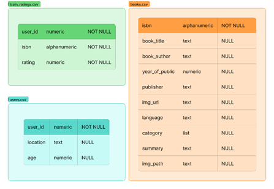
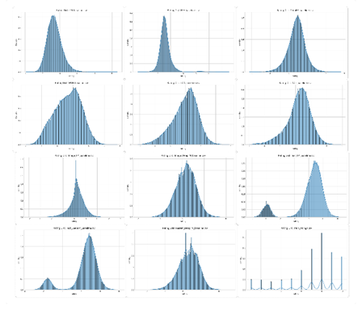
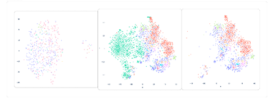
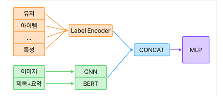
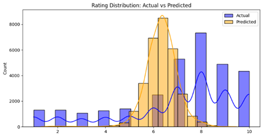
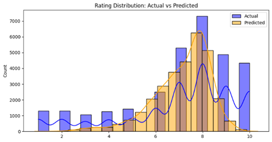

# Book Rating Prediction Wrap-up Report

작성자: 구승민_T8015

## 1. 프로젝트 개요

본 프로젝트는 책 구매 시 소비자가 겪는 신중한 선택의 어려움을 해소하고 구매 결정을 돕기 위해 개인화된 상품 추천을 제공하는 것을 목표로 한다. 이를 위해 책과 관련된 소비자 정보를 토대로 주어진 책에 대한 평점을 1~10점 중 예측하는 방식으로 추천 모델을 개발한다.

## 2. 데이터 개요

학습 데이터는 총 524,457건으로 306,795건의 평점 데이터와 149,570건의 책 정보, 68,092명의 고객 정보로 구성되어 있다. 평가는 총 76,699건의 평점 데이터로, 60%는 공개 점수 계산, 40%는 비공개 점수로 대회 종료 후 평가한다.



## 3. 프로젝트 팀 구성 및 역할
 
본 프로젝트는 총 9일의 개발 기간 동안 6인으로 구성된 인원으로 수행되었으며, 효율적인 학습 및 개발 환경 구축을 위해 2인 1조의 3개 팀 구성으로 서버와 로컬 환경을 병행 활용하였다. 짧은 기간 내 최대 성과 도출을 목표로 3/3/3 전략을 적용하였으며, 이는 초기 3일간의 환경 구축 및 베이스라인 이해, 중간 3일간의 EDA/피처 엔지니어링, 최종 3일간의 모델 개발 및 앙상블을 통한 성능 향상 단계로 구분된다.

## 4. 프로젝트 수행 절차 및 방법

기본으로 제공되는 베이스 모델 결과가 제공되어 해당 결과를 분석하는 것으로 시작한다. 총 7개 모델이 주어지고 11개의 결과에 대해 학습 시간과 RMSE를 확인할 수 있다. 다음 표는 “Tesla V100-SXM2 기준” 학습 결과이다.


평점 1부터 10점까지 예측함에 있어 오차가 높다고 생각했고, 실제로 어떻게 예측되는지 확인하기 위해 결과 분포를 비교하였다.



비교 결과 전체적으로 학습 데이터 대비 부정적으로 평가한다. 이를 해결하기 위해 하이퍼파라미터 조정 및 앙상블 기법을 수행했으나, 결과가 크게 변하지 않았다. 팀원과 결과 공유 중 CLIP을 통한 임베딩 결과를 확인했다.



왼쪽부터 순서대로 이미지, 결측 포함 텍스트, 결측 미포함 텍스트로 이미지는 군집화가 잘 되지 않고, 텍스트는 어느정도 되고 있음을 확인할 수 있다. 위 내용들을 기반으로 다음과 같은 모델 구성을 계획했다.



범주형 특성은 Label Encoder를 통해 분리하였다. 이미지의 경우 큰 영향이 없지만, 더 많은 정보를 제공하기 위해 CNN으로 처리하여 임베딩을 생성한다. 제목과 요약의 경우 자연어 처리를 위해 BERT Encoder를 통해 임베딩을 생성했으며, 마지막에 전체 데이터를 합쳐서 모델에 전달하였다. 결과는 다음과 같다.



확인 결과 아직 전체적으로 부정적으로 평가하고 있음을 알 수 있었다. 이에 팀원과 회의 후 모델에 평균 정보를 입력하면 성능이 개선됨을 전달받았고, MLP 마지막 레이어에 바이어스를 학습 평균(7.5)으로 설정하여 다음과 같은 결과를 얻을 수 있었다.



학습 과정은 다음과 같이 나타났다.

```text
Epoch	Train Loss	Val Loss	Time
1	2.2911	2.1851	681.51s
2	2.0492	2.1657	681.03s
3	1.8559	2.2197	681.39s
```

위 결과가 나오는 이유는 다음과 같이 생각한다. 첫 번째, 임베딩 초기화 방식이다. 기존 임베딩 초기화는 정규 분포로 초기화되기 때문에 초반 손실이 크고 점점 학습 결과에 맞게 변화한다. 이는 레이어 전반에 걸쳐서 손실 결과를 수정해야 하기 때문에 학습 속도가 전반적으로 느릴 수밖에 없다. 두 번째, MSE Loss의 한계이다. 해당 손실 함수는 수학적으로 최소화를 하려고 하기 때문에 평균에 근접하는 것이 가장 손실을 적게 한다. 때문에 학습 과정을 거치면서 점점 평균에 근접하게 되는 성향이 나타난다. 위 이유들 때문에 바이어스를 학습 데이터의 평균으로 설정하는 것이 모델이 더 빠르게 학습하는 것이 가능하여 이와 같은 결과가 나왔다고 생각한다.

```text
평가 시점	RMSE
Public	2.2169
Private	2.2174
```

## 5. 프로젝트 수행 결과

최종 제출 이전 팀원의 모델과 앙상블을 통해 결과 향상을 하기 위해 여러 조합을 시도했고, 팀원인 이성재님의 학습 모델 결과와 앙상블 하여 다음과 같은 결과가 나왔다.

```text
평가 시점	RMSE
Public	2.2016
Private	2.1967
```

앙상블 적용 이전에 학습에 활용된 하이퍼파라미터는 다음과 같다.

```text
종류	값
Epoch	3
BATCH	64
Optimizer	AdamW
Leaning rate	5e-5
Weight decoy	1e-5
Loss Function	MSE(Train)/RMSE(Val)
```

## 6. 자체 평가 의견

모델을 학습시키며 다양한 방식을 알아볼 수 있었다. 모델 학습 결과를 비교 분석하며, 부정적으로 평가함을 판단하고 왜 그렇게 학습하는지 알아보는 과정에서 손실 함수의 특성을 직접 경험할 수 있었다. 또한 전통적인 기계 학습 방식을 활용할 수도 있었으나, MLP를 통한 접근법이 새로웠다. 실제 기계 학습과 많은 차이가 있지 않았으며, 경우에 따라서는 더 좋게 나오기도 했다. 같은 문제에 대해 다른 접근 방식을 고안한 것이 잘한 점이라 생각한다. 그러나, 특징 공학과 결측치 처리에 대해 많은 시간을 활용하지 못한 것이 아쉽다. 도메인에 맞는 처리 방식을 고민하는 것이 성능 개선에 영향을 줄 수 있는 부분임에도 시간 상 이를 진행하지 못했다. 9일의 개발 기간은 전체 과정을 경험하기에 부족했고, 이를 분담하여 접근하지 못하고 각자가 경험한 부분이 아쉽게 느껴졌다. 다음에는 이 부분을 개선하여 접근해볼 생각이다.